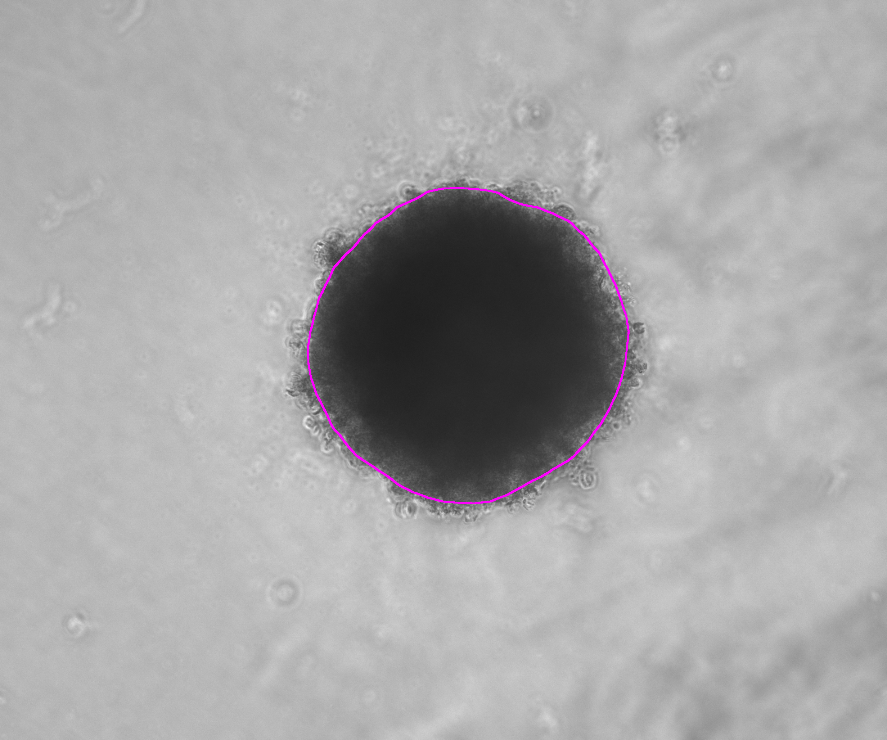
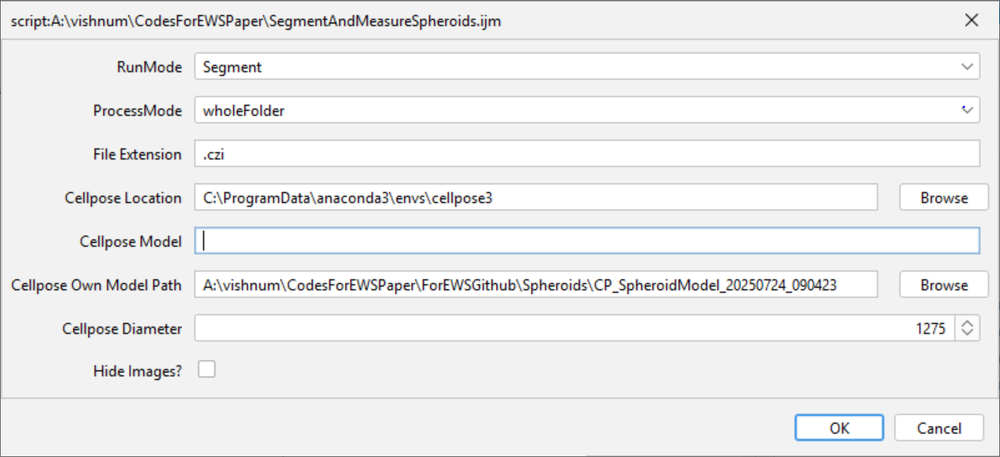

# Proteomic landscapes of Ewing sarcoma unravel immunological regulation of tumor progression 

**Authors:** Sagi Gordon, Vishnu Mohan, Rachel Shukrun, Ofra Golani, Shani Metzger, Osnat Sher, Michal Manisterski, Roni Oren, Liat Fellus-Alyagor, Lir Beck, Yoseph Addadi, Benjamin Dekel, Ronit Elhasid and Tamar Geiger

**DOI:** [To be added upon publication]

---

## Overview

This repository documents the image analysis workflows used in the paper.  
It consists of two main parts:

1. **Immunu-Fluorescence Panels**

Image data are available in the BioImage Archive (http://www.ebi.ac.uk/bioimage-archive) under accession number S-BIAD1597.
      
3. **Spheroids analysis** 

 
---

## Immunu-Fluorescence Panels

### Overview

To validate the proteomic-based predictions, we profiled the main immune cell populations using multiplexed immunofluorescence imaging of neutrophils (MPO and CD15), macrophages (CD68, HLADR, and MRC1), T-cells (CD4 and CD8), and the EWS cancer cells (NKX2.2) on a subset of the primary tumors. 
Three staining panels were used for immunofluorescence: 
i) Panel I    : NKX2.2, MPO, CD15, CD68 and hochest
ii) Panel II  : NKX2.2, CD4, CD8 and hochest 
iii) Panel III: NKX2.2, CD68, HLAII, MRC1, PSMA3 and hochest

Quantification of each panel was done using the following workflow: 

Nuclear segmentation was performed using the “Nuclei” model of **Cellpose** 2.0 followed by expansion (estimated diameter of 14 pixels, expansion of up to 5 pixels) as implemented in the Qupath Cellpose extension v0.9.6.  Nuclei larger than 180 un^2 were discarded after expansion. A Random Trees machine learning object classifier was trained in **Qupath** v0.5.1 on a training panel of representative stitched regions of 500*500µm from multiple slides. Proteomic regions of interest (ROIs) were manually annotated on the Opal slides with guidance from consecutive H&E sections (set to class "Proteomics ROI"). All downstream analysis were performed with percentage of cells expressing the marker in  these P-ROIs. 

This workflow is implemented as QuPath script **RunCellpose_WholeTissue_IF_Panel.groovy**. Set *CellClassifierName* based on the analyzed panel 

## Spheroids Analysis

### Overview

Spheroids were segmented from the provided images, and their areas were measured.  
Segmentation was performed in **Fiji** using a **Cellpose** model trained on a sample of the dataset:  
`CP_SpheroidModel_20250724_090423`.

In rare cases, manual correction of the segmentation can be applied.  
The analysis is implemented in the Fiji script:  
`SegmentAndMeasureSpheroids.ijm`.

---

### Example Results

Two example overlay images are shown below (placeholders):  

| 010625-A673_Parental_ETOPOSIDE-DOXO_B2 | 010625-A673_Parental_ETOPOSIDE-DOXO_B10 |
|-----------------|-----------------|
|  |  |

---

### Dependencies

- [Fiji](https://fiji.sc/) installed  
- [PTBIOP plugin for Fiji](https://biop.epfl.ch/)  
- **Cellpose 3 environment** (not Cellpose 4) — installation guide here:  
  [Forum: Install Cellpose 3](https://forum.image.sc/t/install-cellpose-3/112198)  

---

### Usage

1. Open Fiji.  
2. Drag & drop the script `spheroids/SegmentAndMeasureSpheroids.ijm` into Fiji.  
3. Configure the parameters (screenshot placeholder below):  

     
   
#### Parameters

- **RunMode**: `Segment` or `Update`  
- **ProcessMode**: `singleFile` / `wholeFolder` / `allSubFolders`  
- **Cellpose Location**: folder of the installed Cellpose environment  
- **CellposeModel**: leave empty  
- **Cellpose Own Model Path**: path to the trained Cellpose model  
- **Cellpose Diameter**: `1275`  

---

### Output

Results are saved under the `spheroids/SampleData/results/` folder.

For each input file (`FILENAME`):

- `FILENAME_DetailedResults.xls`  
- `FILENAME_Overlay.tif`  
- `FILENAME_SpheroidRoiSet.roi`  

Aggregated results:

- `AllDetailedResults_FolderName.xls`  
- `SegmentAndMeasureSpheroids.txt` (logs the parameters used for the run)  

---

### Manual Update

Manual corrections can be performed following the instructions in:  
[Manual Correction Section](https://github.com/WIS-MICC-CellObservatory/Crypts_SpatialOrganization)

---

## Repository Structure

